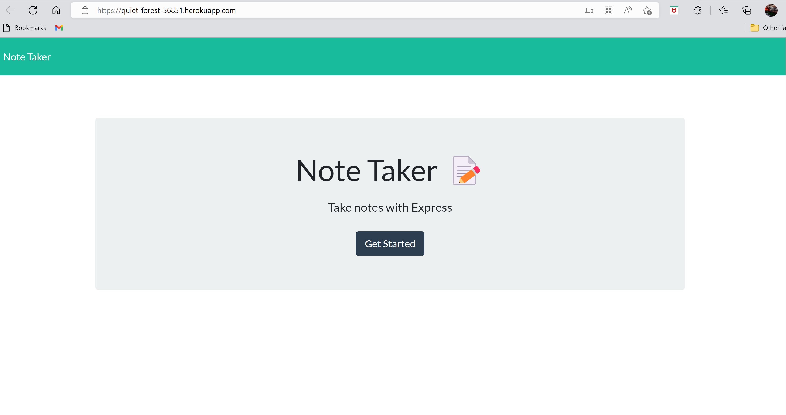
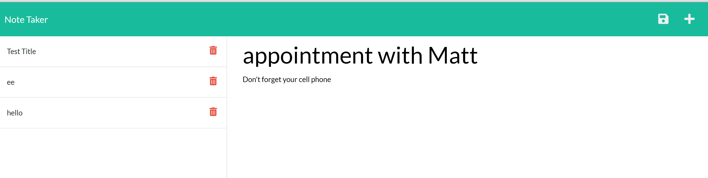
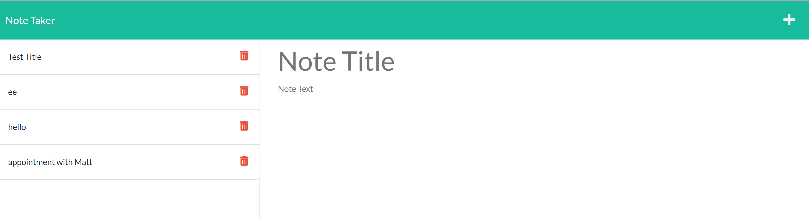

# Title of the Project:

# Note Taker

## Description:

## Note Taker is made with node.js and express.js. Is allowes the user to not title and the body of the note on the right side of the page, then the note will be saved on the left side of the page.

## Table of Content:

1. [Installation Instructions](#installation)
2. [Usage Information](#usage)
3. [License Information](#License)
4. [Contribution](#contributing)
5. [Tests](#tests)
6. [Questions](#questions)

## installation:

## 1. run command "npm i in root folder to install dependancies"

## 2. run command "node index.js"

## Usage:

## to be used to get and post the user notes.

## License: 

## _Apache_

## contributing:

## class mates

## Tests:

## Insomnia

## Questions:

you can finde my GitHub at:

## [wasim202](https://github.com/wasim202)

If you have any questions please email me at:

## wsmohd87@gmail.com

## [Heroku deployment link](https://quiet-forest-56851.herokuapp.com/)
